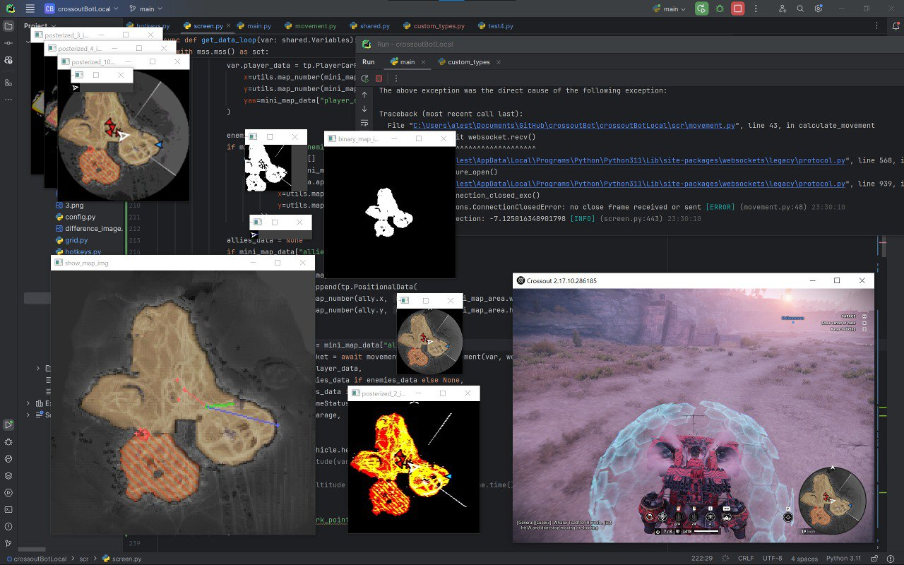

# Crossout Automation: Distributed Bot System
This project is a game automation system for Crossout, consisting of a high-speed client and a dedicated pathfinding server. Explores real-time computer vision, multi-threaded architecture, and distributed systems.

<figure>
  
  <figcaption><i>A screenshot of the bot’s interface and processing capabilities during early-stage development.</i></figcaption>
</figure>

## Project Overview
The system is split into two main components to optimize performance:
1.  **[client](./client)**: Handles real-time screen capture, player location, enemy detection, game state awareness, and input simulation.
2.  **[server](./server)**: A dedicated backend that manages map data and performs pathfinding calculations.

## Technical Stack
- **System**: Windows 10
- **Language**: Python 3.11
- **Computer Vision**: OpenCV, NumPy
- **Backend & API**: FastAPI, Uvicorn, WebSockets
- **Automation**: PyDirectInput, Win32API, ctypes
- **Algorithms**: Custom A* with path smoothing, ROI optimization

## Core Features
- **Real-Time Computer Vision**: Uses OpenCV for fast detection of enemy markers and player localization on the minimap.
- **Distributed Navigation**: Offloads pathfinding to a FastAPI-based server to maintain high frame rates on the client.
- **Multi-Threaded Execution**: The client runs 6+ concurrent threads to handle independent tasks like camera input and target tracking.
- **Intelligent Menu Navigation**: Automatically recognizes and navigates game menus by analyzing UI templates.
- **Custom Mapping Tools**: Includes a system for recording and generating drivable masks from in-game data.

## Lessons
- **Initial Design**: Getting the code foundation right at the start is essential. I had to redo the core structure multiple times.
- **Language Selection**: High-frequency image processing in native Python faces performance bottlenecks. For higher FPS, moving image processing tasks to C++ or Rust would be more effective.
- **Distributed Design**: Separating navigation from vision significantly improved client-side responsiveness.
- **Custom Tooling**: Building my own visualization system boosted my productivity and made algorithm outputs easier to understand.
- **Input Latency**: Simulating mouse and keyboard inputs introduced a 4.5ms delay, which hindered real-time performance. Moving to controller simulation would likely reduce latency and enable much smoother movement.

## Project Status
Built for educational purposes, no longer being updated.
